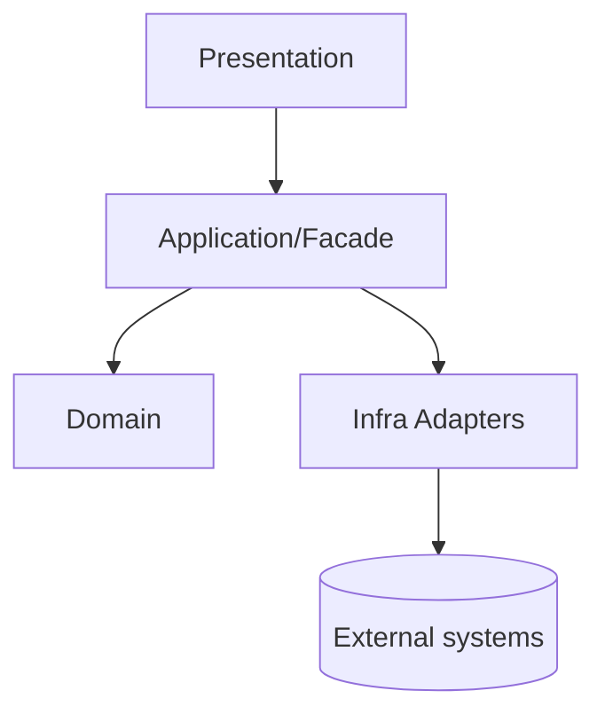
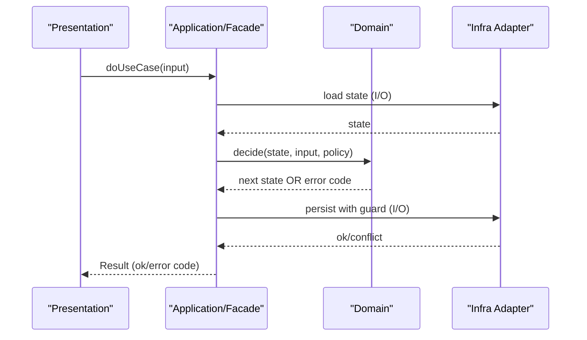
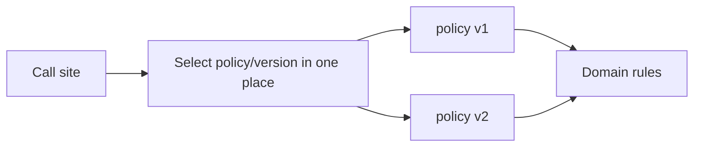

# Mermaid templates (optional)

Use at most 0–1 diagram unless the user explicitly asks for more.

## Purpose (avoid misreading)
These diagrams are **conceptual coupling/flow sketches**, not framework-specific blueprints.
- Rename nodes to match your system vocabulary.
- Use diagrams to check **responsibility boundaries** and **dependency direction**.
- Do not diagram every helper function; only show the stable concepts/entrypoints.

## Vocabulary mapping
See "Stack-agnostic vocabulary" in SKILL.md for the canonical definitions. Rename diagram nodes to match your system's actual vocabulary.

## Coupling map (dependency graph)

## Use-case orchestration (sequence)

## Policy/version selection

## Notes
- Keep diagrams semantic: show responsibilities and dependencies, not every helper function.
- In `sequenceDiagram`, participants should be active entities (UI/service/domain/adapter), not passive data objects.
- Quote any participant alias or label that contains spaces or non-ASCII characters.
