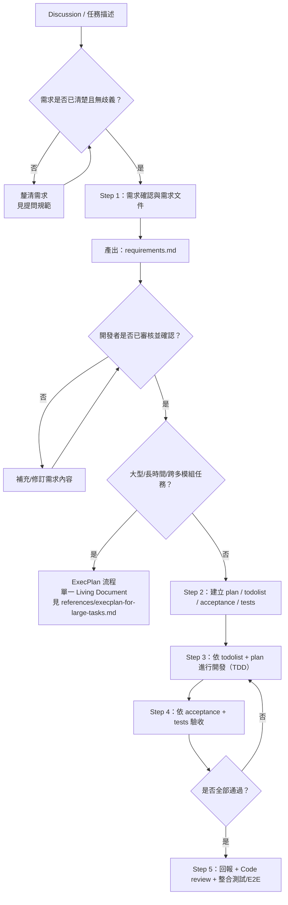

# Plan Mode Pro

由討論開始，逐步收斂到可執行的計畫與驗收文件。



---

## Step 1. 確認需求

**AI 必須先理解專案，再提出可落地的方案來完成需求確認。**

前置判斷：
- 需求已清楚 → 直接進入 1.1
- 需求不明確/有歧義 → 先按提問規範釐清，完成後回到本流程

### 1.1 專案理解（必做前置）
1. 讀取 `spec.md`、`.kiro/specs/*/requirements.md` 理解需求規格
2. 讀取 `AGENTS.md`、`docs/memory/memoryindex.md` 了解架構與既有經驗
3. 如需求與現有規格衝突，提出 2-3 個解決方案選項

### 1.2 Codebase 調查
1. 使用 code tool / search 定位相關功能，理解現有實作與資料流
2. 分析現有模式與架構，識別修改點和技術限制
3. 評估變更範圍和潛在風險

### 1.3 方案導向確認（不要空泛提問）
1. 基於 codebase 分析提出 2-3 個實作選項，清楚說明取捨
2. 選擇題優先，避免開放式發散提問
3. 每個確認點都要有程式碼或規格依據；只在資訊不足時才提問

### 1.4 需求文件撰寫
基於理解和確認，撰寫包含現況分析（As-is）、目標需求（To-be）、驗收標準草案的需求文件。

**產出**：`requirements.md`（依 task 資料夾位置命名）
- 內容：開發目的（what/why）、範圍、非目標、使用情境、驗收標準草案
- 此文件只記錄需求，不含實作程式碼

詳細模板 → `references/writing-requirements.md`

---

## ExecPlan 判斷（Step 1 完成後）

需求確認完成後，判斷是否改用 ExecPlan 流程：

**符合任一條件 → 使用 ExecPlan**：
- 預計執行跨越多天或多個工作階段
- 跨 3 個以上模組的系統變更
- 需要原型驗證才能確認可行性
- 未來可能由不熟悉專案的人接手

使用 ExecPlan 時，Step 1 的需求確認仍然適用，但 Step 2-5 由 ExecPlan 的單一 Living Document 流程取代。

詳細規範 → `references/execplan-for-large-tasks.md`

**不符合 → 繼續預設流程（Step 2-5）**

---

## Step 2. 建立開發文件

開發者審核確認 `requirements.md` 後，建立可執行的開發文件。

### 前置
1. 理解專案架構
2. 讀 `docs/memory/memoryindex.md`（吸收既有經驗，避免重複犯錯）
3. 讀 `.kiro/steering/*`（對齊專案規範與慣例）

### 必要文件（同時產出）

**plan.md**：技術方案、架構決策、修改位置、使用套件、實作步驟（Phase → Task）、風險緩解、時間估算
- 詳細模板 → `references/writing-plan.md`

**todolist.md**：執行 checklist（含並行分工，以及需安裝套件或使用者要執行的指令）
- 詳細模板 → `references/writing-plan.md`

**acceptance.md**：驗收條件（Given/When/Then）、error cases、edge cases
- 詳細模板 → `references/writing-acceptance.md`

**tests.md**：測試分層（Property-Based / Integration / Unit / E2E）、測試檔案清單、執行指令
- 詳細模板 → `references/writing-test.md`

### 工程流程
```
Requirement → Phase → Task → Do → Check → Test → Verify Success Criteria → Next Phase
```
每個 Phase 完成後必須驗證 Success Criteria 才能進入下一階段。

大型任務可拆分資料夾：
```
docs/02_workflows/<context>/task/<subtask1>/plan.md
docs/02_workflows/<context>/task/<subtask2>/plan.md
```

---

## Step 3. TDD 開發

依 `todolist.md` + `plan.md` 開發。「撰寫 tests」與「功能開發」通常並行；完成後同步更新 `todolist.md`。

---

## Step 4. 驗收

依 `tests.md` + `acceptance.md` 驗證。未通過：修正 → 重測 → 直到全部通過。

---

## Step 5. 完成

- 向使用者回報結果
- 完整 code review
- 整合測試 / E2E（無法自動化的部分由使用者手動測試）
- 撰寫詳細 commit message（不自行 commit，由使用者決定）
- 若有需人工驗證的情境：建立測試人員說明檔（位置：`docs/08_testing/e2e/`）

---

## 提問規範

詳見 `references/how-to-AskUserQuestion.md`

**適合問使用者**：系統設計衝突、design pattern 選擇、業務邏輯決策、文件規格衝突

**不適合問使用者**：
- 專案現況 → 查 codebase
- 系統規劃 → 查 `.kiro/specs/`
- 可查到的知識 → web search

**提問格式**：選擇題優先，每個選項附 pros/cons，明確推薦一個並說明理由。
