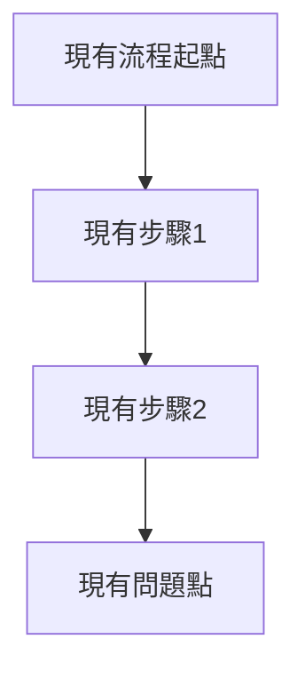
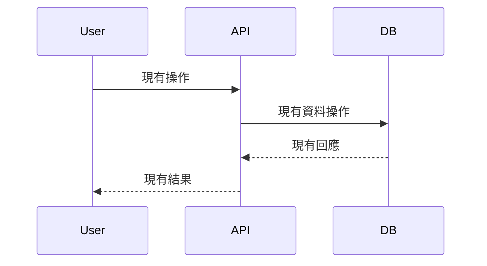

# Writing Requirements（requirements.md）

目的：指導 AI agent 如何進行深度需求確認，並撰寫高品質的 requirement.md 文件。重點是讓 AI 先理解專案和 codebase，再提出有建設性的方案而非空泛問題。

建議位置：`docs/02_workflows/task/<NNN_task_name>/<NNN>_requirement.md`

---

## 1) Requirements 文件的職責

Requirements 文件寫：
- 需求背景和現況分析（As-is）
- 具體要修改/新增什麼（To-be）
- 使用者故事和驗收標準
- 非目標和範圍限制
- 驗收標準草案

Requirements 文件不寫：
- 技術實作細節（放到 `plan.md`）
- 測試策略（放到 `tests.md`）
- 具體程式碼位置（放到 `plan.md`）

---

## 2) 需求確認流程（AI Agent 必須遵循）

### 階段 1：專案理解（必做前置作業）

**步驟 1.1：讀取專案規格文件**
```
必須先讀取以下文件（依序）：
1. 專案根目錄的 spec.md 或 requirements.md（通用規格）
2. .kiro/specs/*/requirements.md（功能模組規格）
3. AGENTS.md（專案架構概覽）
4. docs/memory/memoryindex.md（開發經驗記憶）
```

**步驟 1.2：衝突檢查**
如果使用者需求與現有規格衝突：
- 明確指出衝突點
- 提供 2-3 個解決方案選項
- 說明每個方案的影響和取捨

**步驟 1.3：架構理解**
理解專案的：
- 多租戶架構（organization_id 隔離）
- 使用者角色和權限
- 資料模型和關聯
- 現有功能模組

### 階段 2：Codebase 調查（主動研究）

**步驟 2.1：相關程式碼調查**
使用 code tool 主動調查：
```
1. 搜尋相關 symbols：search_symbols
2. 查看現有實作：goto_definition
3. 了解資料結構：get_document_symbols
4. 檢查相關 API：find_references
```

**步驟 2.2：現況分析**
基於程式碼調查，分析：
- 現有功能如何運作
- 資料流程和狀態管理
- 可能的修改點和影響範圍
- 現有限制和技術債務

### 階段 3：方案導向確認（不要空泛提問）

**✅ 好的確認方式（提供方案）**：
```
基於我對 codebase 的分析，我發現現在的週報流程是：
[具體流程描述]

針對你的需求，我看到 3 個可能的實作方向：

A. 擴展現有 weekly_reports 表，新增班級週報欄位
   - 優點：保持現有 PDF 生成邏輯
   - 缺點：表結構會變複雜
   
B. 新建 class_weekly_records 表，PDF 生成時合併
   - 優點：資料結構清晰
   - 缺點：需要修改 PDF 生成邏輯
   
C. 重構為統一的 weekly_records 表（支援個人/班級類型）
   - 優點：未來擴展性好
   - 缺點：需要資料遷移

你偏好哪個方向？還是有其他考量？
```

**❌ 不好的確認方式（空泛提問）**：
```
你希望週報功能怎麼運作？
你想要什麼樣的 PDF 格式？
需要支援哪些使用者角色？
```

### 階段 4：細節確認（選擇題優先）

**優先使用選擇題**：
```
關於照片數量限制，基於現有 PDF 模板分析：

A. 班級照片最多 4 張（對應現有模板設計）
B. 班級照片最多 6 張（需要調整模板）
C. 不限制數量（PDF 自動分頁）

建議選 A，因為現有模板已經針對 4 張照片優化。你的想法？
```

**只在真正不確定時才開放提問**：
```
我在 codebase 中看到 5 種 PDF 模板，但不確定輪替邏輯：
- 是按週循環（週1用模板1，週2用模板2...）？
- 還是按學生循環（學生A用模板1，學生B用模板2...）？
- 或是隨機選擇？

這個邏輯會影響資料庫設計，請確認。
```

---

## 3) Requirements 文件模板

```markdown
# <NNN> Requirement: <功能名稱>

> 狀態：Draft / Approved（Step 1 完成）  
> 依 `docs/02_workflows/Planmode/planmode.md`：本文件只寫「需求」，不寫技術方案/程式位置。

## A. 現在狀況與運作邏輯（As-is）

> 本段是「目前程式實際怎麼跑」的流程圖與文字描述（用來避免討論變成猜測）。

### A1 現有功能描述
- [描述現有功能如何運作]
- [指出現有問題或限制]
- [說明使用者當前的困擾]

### A2 現況流程圖（Mermaid）


### A3 資料流程（如需要）


## B. 要修改/新增什麼（To-be）

> 基於 codebase 分析和使用者需求，明確說明要改變什麼。

### B1 核心需求
需求 1：[具體需求描述]
- [詳細說明要達成什麼]
- [說明與現有功能的關係]

需求 2：[具體需求描述]
- [詳細說明要達成什麼]
- [說明資料結構需求]

### B2 使用者體驗改進
- [描述使用者操作流程的改變]
- [說明介面和互動的調整]

### B3 資料模型調整
- [說明需要新增/修改的資料表]
- [說明資料關聯和約束]

### B4 整合策略
- [說明如何與現有功能整合]
- [說明相容性和遷移考量]

## C. 非目標（Non-goals）
- [明確說明不做什麼]
- [說明範圍限制]
- [說明未來版本才考慮的功能]

## D. 驗收標準草案（Acceptance Draft）
1. [具體可驗證的標準1]
2. [具體可驗證的標準2]
3. [具體可驗證的標準3]
...

## E. 影響分析（基於 Codebase 調查）

### E1 影響的模組
- `path/to/module1` - [影響說明]
- `path/to/module2` - [影響說明]

### E2 資料庫變更
- [需要新增的表]
- [需要修改的表]
- [需要的資料遷移]

### E3 API 變更
- [需要新增的 API]
- [需要修改的 API]
- [向後相容性考量]

### E4 風險評估
- [技術風險和緩解方案]
- [使用者體驗風險]
- [資料一致性風險]
```

---

## 4) AI Agent 執行指令

### 階段 1：專案理解指令
```
任務：理解專案架構和現有規格
步驟：
1. 讀取專案根目錄的 spec.md 或類似命名文件
2. 讀取 .kiro/specs/*/requirements.md
3. 讀取 AGENTS.md 了解架構
4. 讀取 docs/memory/memoryindex.md 了解開發經驗
5. 如發現需求衝突，提出具體解決方案選項
```

### 階段 2：Codebase 調查指令
```
任務：主動調查相關程式碼
步驟：
1. 使用 search_symbols 搜尋相關功能模組
2. 使用 goto_definition 了解現有實作
3. 使用 find_references 了解功能使用情況
4. 分析現有資料流程和狀態管理
5. 識別可能的修改點和影響範圍
```

### 階段 3：方案導向確認指令
```
任務：提供具體方案而非空泛問題
原則：
1. 基於 codebase 分析提出 2-3 個實作方案
2. 說明每個方案的優缺點和影響
3. 優先使用選擇題確認細節
4. 只在真正不確定時才開放提問
5. 每個問題都要有技術背景說明
```

### 階段 4：文件撰寫指令
```
任務：撰寫高品質 requirement.md
步驟：
1. 使用模板結構撰寫
2. As-is 部分必須基於實際 codebase 分析
3. To-be 部分必須具體可執行
4. 包含 Mermaid 流程圖說明現況和目標
5. 驗收標準必須具體可測試
6. 影響分析基於實際程式碼調查
```

---

## 5) 品質檢查清單

**專案理解**
- [ ] 已讀取所有相關規格文件
- [ ] 已識別並解決需求衝突
- [ ] 理解多租戶架構和權限模型
- [ ] 了解現有功能模組和資料模型

**Codebase 調查**
- [ ] 已調查相關程式碼模組
- [ ] 理解現有資料流程
- [ ] 識別修改點和影響範圍
- [ ] 分析技術限制和風險

**需求確認**
- [ ] 提供具體方案而非空泛問題
- [ ] 使用選擇題優先確認細節
- [ ] 每個問題都有技術背景
- [ ] 確認所有關鍵決策點

**文件品質**
- [ ] As-is 基於實際程式碼分析
- [ ] To-be 具體可執行
- [ ] 包含清楚的流程圖
- [ ] 驗收標準可測試
- [ ] 影響分析完整

---

## 6) 常見錯誤與改進

### ❌ 常見錯誤
1. **不理解 codebase 就提問** - 導致問題品質差
2. **空泛的開放式問題** - 浪費時間且不精確
3. **忽略現有規格衝突** - 造成後續實作問題
4. **缺乏技術背景的確認** - 決策缺乏依據

### ✅ 改進方式
1. **先調查再提問** - 基於理解提出有建設性的方案
2. **方案導向確認** - 提供選項而非開放問題
3. **主動衝突檢查** - 確保需求一致性
4. **技術背景說明** - 每個確認都有程式碼依據

---

## 7) 成功標準

滿足才算「Requirements 文件可進入規劃」：
- [ ] 完整理解專案架構和現有功能
- [ ] 基於實際 codebase 分析撰寫 As-is
- [ ] 需求具體可執行且無衝突
- [ ] 驗收標準清楚可測試
- [ ] 影響分析完整且準確
- [ ] 使用者明確確認所有關鍵決策
